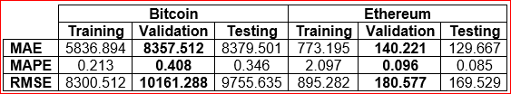
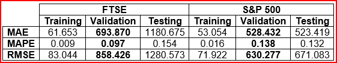
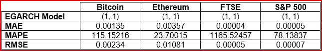
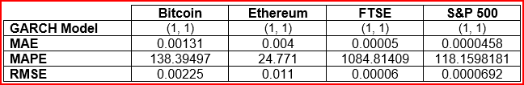

# Forecasting Financial Markets: Comparing Time Series and Neural Network Models

## Project Background

This project is centred around supporting a strategic evaluation of forecasting techniques within a financial analytics firm. The core objective is to assess whether classical time series models or artificial neural networks are more effective in forecasting market returns and volatility, with the goal of improving the firms' efficiency and forecasting accuracy. The models were applied to major stock indices (FTSE 100, S&P 500) and cryptocurrencies (Bitcoin, Ethereum) using data from 2018 to 2023.

The project compares ARIMA, GARCH, and EGARCH models with an LSTM neural networks. Evaluating forecast accuracy across metrics including RMSE, MAE, and MAPE, providing a data-driven recommendation for model selection based on performance, robustness, and asset class characteristics.

**Key Focus Areas:**

- Returns Forecasting Accuracy (ARIMA vs LSTM)
- Volatility Modelling (GARCH vs EGARCH)
- Model Efficiency and Interpretability
- Forecast Performance by Asset Class (Stocks vs Crypto)

🔗 [Bitcoin Code](Bitcoin)  🔗 [Ethereum Code](Ethereum) 🔗 [FTSE Code](FTSE) 🔗 [S&P 500 Code](S&P_500)  🔗 [ARIMA Code](ARIMA_R_Code.R)  

---

## Data Structure & Initial Checks

Data was obtained from Yahoo Finance and includes:

- **FTSE 100** (^FTSE)
- **S&P 500** (^GSPC)
- **Bitcoin** (BTC-USD)
- **Ethereum** (ETH-USD)

Variables used in this analysis:

- `Close Prices`: The last price of the stock that is transacted before the market closes for normal trading.  
- `Returns%`: The daily change in the price of an asset over time.   
- `Log Returns`: The log of the daily change in the price of an asset over time.
- `Test_Return`: Logarithmic return of the asset during the testing period, used to assess final model performance on unseen data.
- `Train_Return`: Logarithmic return of the asset during the training period, used to fit forecasting models. It captures historical return behaviour for model learning.
- `Val_Return`: Logarithmic return of the asset during the validation period, used to tune model parameters and evaluate generalisation during training.
- `Date`: Calendar date corresponding to each return observation. Used to align time series data and segment periods for training, validation, and testing. 

Each asset had ~1250–1800 records. All series were tested for stationarity (ADF test), and returns were log-transformed to meet model assumptions. Missing values are cleaned, and datasets are scaled appropriately for LSTM modelling.

🔗 [Flowcharts](Images)

---

## Executive Summary

The analysis determined that traditional time series models provide more reliable forecasts than LSTM models when working with relatively limited financial time series data. ARIMA outperformed LSTM in returns forecasting across all assets. EGARCH delivered the most accurate volatility forecasts, due to its ability to model asymmetric shocks. Stock indices were generally easier to forecast than cryptocurrencies, producing lower error rates. Therefore, the firm should operate primarily using time series models, such as ARIMA for returns and EGARCH for volatility, while forecasting for stocks only to mitigate cryptocurrency volatility exposure.

**Summary of Findings:**

1. **ARIMA achieved the lowest RMSE and MAE** in returns forecasting.
2. **EGARCH consistently outperformed GARCH** in modeling volatility.
3. **Stocks delivered more predictable outcomes** than cryptocurrencies.

🔗 [Figures](Figures)

---

## Insights Deep Dive

### 1. Return Forecasting: ARIMA vs LSTM

- **Bitcoin ARIMA RMSE:** 0.037 | **LSTM RMSE:** 9755  
- **FTSE ARIMA MAE:** 0.008 | **LSTM MAE (Test):** 1180  
- **S&P 500 ARIMA MAPE:** 182.9 | **LSTM MAPE:** 0.132  
- The LSTM model exhibited overfitting and generalisation on test data

🔗 [ARIMA Returns](Images/ARIMA_Model_Forecasting_Results.png)

   

### 2. Volatility Forecasting: GARCH vs EGARCH

- **Ethereum EGARCH RMSE:** 0.01081 | **GARCH RMSE:** 0.011  
- **FTSE EGARCH MAE:** 0.00004 (lowest overall)  
- EGARCH captured leverage effects and asymmetry slightly more effectively than GARCH

   

### 3. Stocks vs Crypto Forecasting

- **FTSE ARIMA RMSE:** 0.012 | **Bitcoin ARIMA RMSE:** 0.037  
- **S&P 500 EGARCH RMSE:** 0.00007 | **Ethereum EGARCH RMSE:** 0.01081  
- Cryptocurrencies had higher errors due to greater volatility and price noise

### 4. Model Efficiency and Configuration

- **ARIMA:** Optimized with `auto.arima()` using AIC and MLE  
- **GARCH/EGARCH:** Rolling 4-month forecasts; (1,1) orders  
- **LSTM:** Keras sequential model, time step = 3, dropout (0.2–0.9)  
  - Training: 80%, Validation: 10%, Testing: 10%  
  - Loss function: MSE, Optimiser: Adam  
  - Layer setup: LSTM → Dropout → Dense x3

---

## Recommendations

Based on the results, the following recommendations are made:

1. **Use ARIMA** for short to medium-term return forecasting.
2. **Implement EGARCH** when modelling volatility with asymmetric risks.
3. **Avoid LSTM** unless larger datasets or exogenous features are available.
4. **Prioritize stock indices** over cryptocurrencies for forecast-driven strategies.
5. **Incorporate macroeconomic variables** to improve LSTM generalization.

---

## Assumptions and Caveats

- Log returns are not actual returns, but were used to normalise variance and enable time series modelling.
- All series were cleaned and tested for stationarity (ADF test).
- LSTM models excluded macroeconomic or sentiment variables.
- Forecasting spanned a consistent window (2018–2023) across all assets.
- RMSE, MAE, and MAPE were computed on out-of-sample predictions.

---

